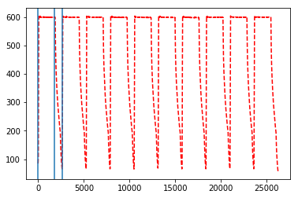

# Square wave edge detection
 - [X] import data.txt
 - [X] plot square wave
 - [X] calculate edge with FFT
 - [ ] test on more data


```python
import pandas as pd
import numpy as np
import matplotlib.pyplot as plt

data = pd.read_csv('data.txt',sep='\s+',header=None)
data = pd.DataFrame(data)
time = data[0]
ampli = data[1]
plt.plot(time, ampli,'r--')
plt.show()
```


    [<matplotlib.lines.Line2D at 0x215dceb9240>]


```python
import numpy.fft as fft
# compute the Fourier transform
spectrum = fft.fft(ampli)

# plot the magnitudes of the FFT as
freq = fft.fftfreq(len(spectrum))
plt.plot(freq, abs(spectrum))
plt.xlim(-0.01,0.01)

# and what you see should match up with what displays on the oscilloscope.
# If you want to identify the dominant frequencies in the spectrum, 
# you'll have to cut the array at some threshold, e.g. something like this:

threshold = 0.01 * max(abs(spectrum))
mask = abs(spectrum) > threshold
peaks = freq[mask]
peaks = np.delete(peaks, 0)
print(peaks)
period = 1/peaks[:3]
period.sort()
print(period)
```


    [<matplotlib.lines.Line2D at 0x215e0d2d6a0>]


    (-0.01, 0.01)


    [ 0.00019047  0.00038094  0.00057141 ... -0.00057141 -0.00038094
     -0.00019047]
    [1750.06666667 2625.1        5250.2       ]
    


```python
print(period)
plt.plot(time, ampli,'r--')
plt.axvline(x=0)
plt.axvline(x=period[0])
plt.axvline(x=period[1])
plt.show()

```

    [1750.06666667 2625.1        5250.2       ]
    


    [<matplotlib.lines.Line2D at 0x215e00850b8>]


    <matplotlib.lines.Line2D at 0x215e00854e0>


    <matplotlib.lines.Line2D at 0x215e0085588>


    <matplotlib.lines.Line2D at 0x215e0085b00>




